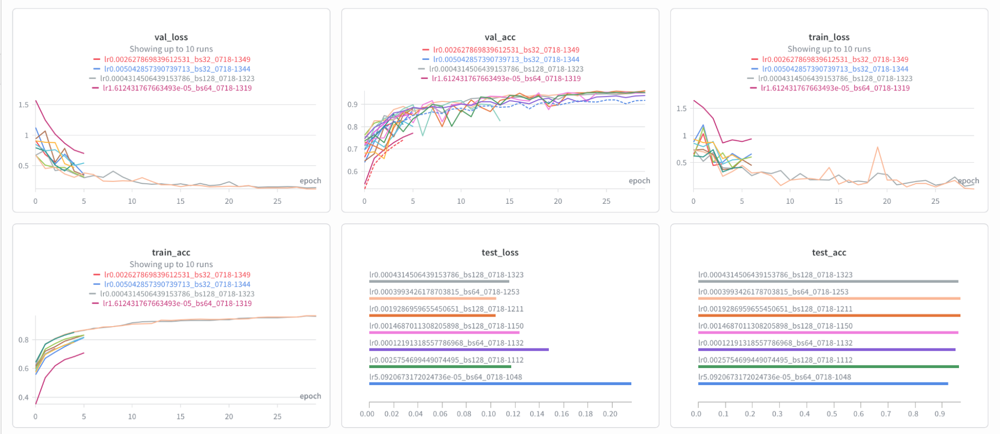
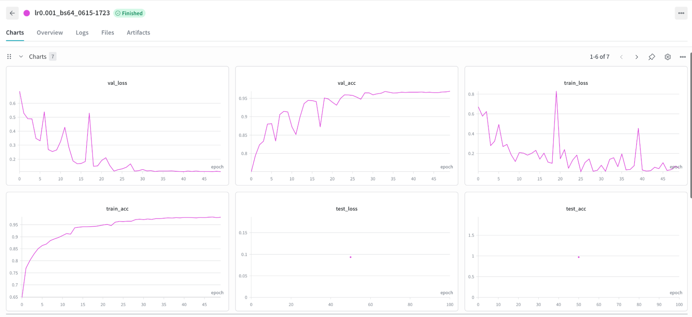
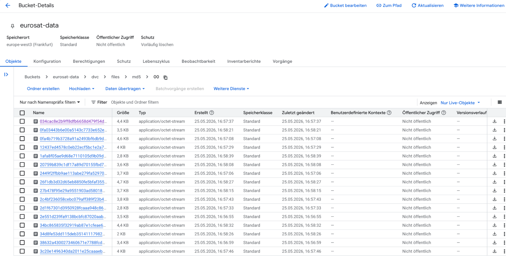
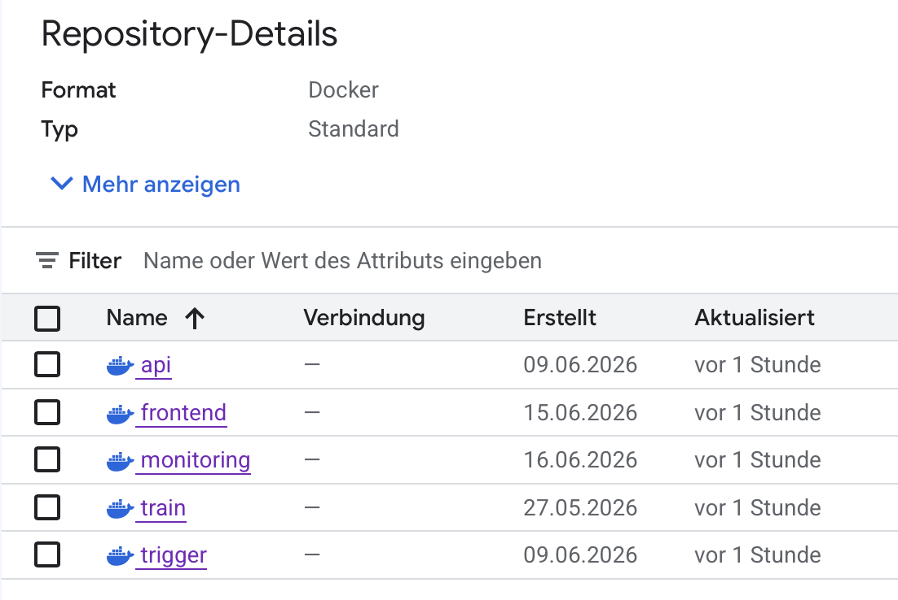
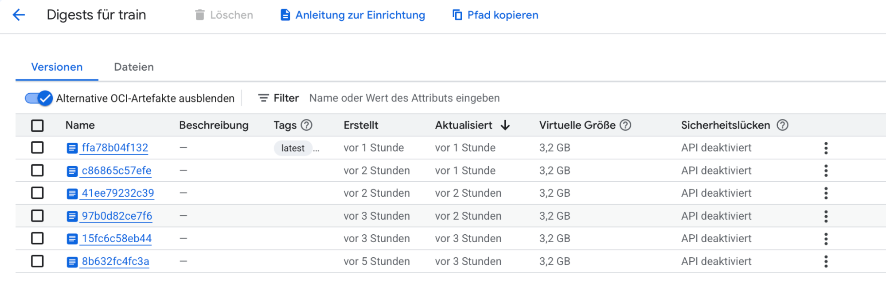
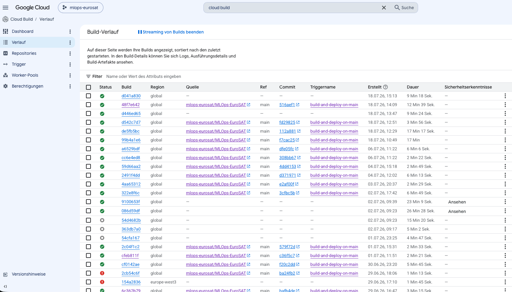
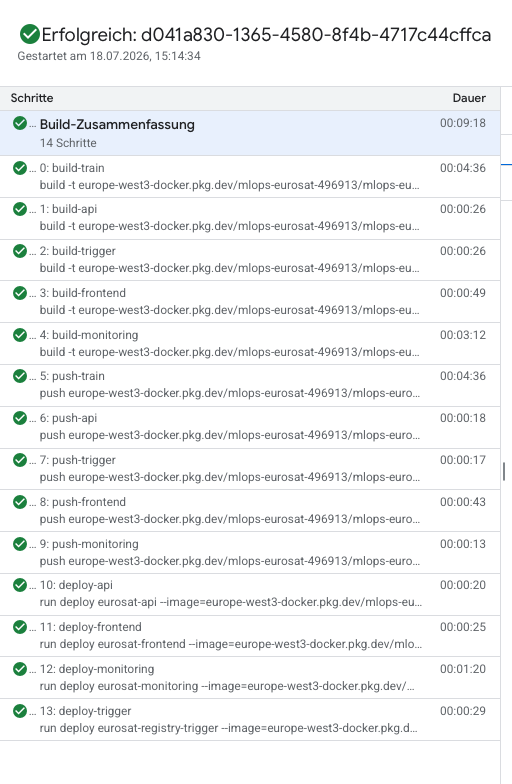
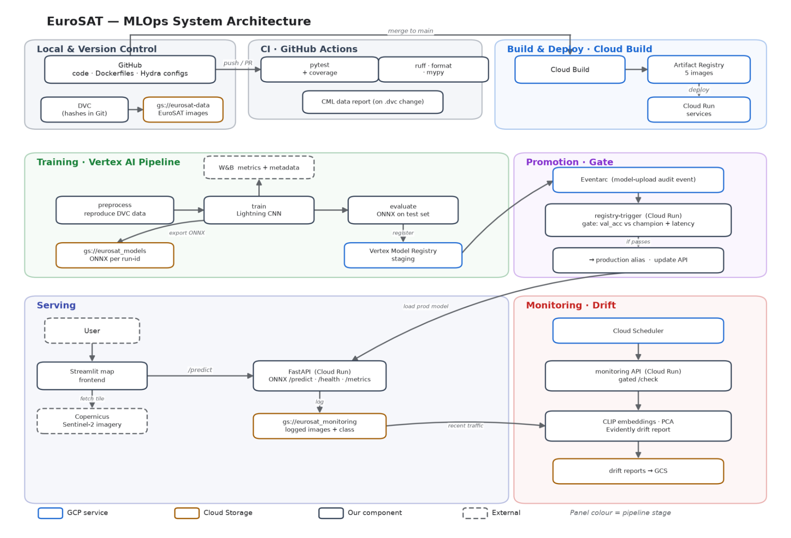

# MLOps Report

This is the report template for the exam. Please only remove the text formatted as with three dashes in front and behind
like:

```--- question 1 fill here ---```

Where you instead should add your answers. Any other changes may have unwanted consequences when your report is
auto-generated at the end of the course. For questions where you are asked to include images, start by adding the image
to the `figures` subfolder (please only use `.png`, `.jpg` or `.jpeg`) and then add the following code in your answer:

``

In addition to this markdown file, we also provide the `report.py` script that provides two utility functions:

Running:

```bash
python report.py html
```

Will generate a `.html` page of your report. After the deadline for answering this template, we will auto-scrape
everything in this `reports` folder and then use this utility to generate a `.html` page that will be your serve
as your final hand-in.

Running

```bash
python report.py check
```

Will check your answers in this template against the constraints listed for each question e.g. is your answer too
short, too long, or have you included an image when asked. For both functions to work you mustn't rename anything.
The script has two dependencies that can be installed with

```bash
pip install typer markdown
```

or

```bash
uv add typer markdown
```

## Overall project checklist

The checklist is *exhaustive* which means that it includes everything that you could do on the project included in the
curriculum in this course. Therefore, we do not expect at all that you have checked all boxes at the end of the project.
The parenthesis at the end indicates what module the bullet point is related to. Please be honest in your answers, we
will check the repositories and the code to verify your answers.

### Week 1

* [x] Create a git repository (M5)
* [x] Make sure that all team members have write access to the GitHub repository (M5)
* [x] Create a dedicated environment for you project to keep track of your packages (M2)
* [x] Create the initial file structure using cookiecutter with an appropriate template (M6)
* [x] Fill out the `data.py` file such that it downloads whatever data you need and preprocesses it (if necessary) (M6)
* [x] Add a model to `model.py` and a training procedure to `train.py` and get that running (M6)
* [x] Remember to either fill out the `requirements.txt`/`requirements_dev.txt` files or keeping your
    `pyproject.toml`/`uv.lock` up-to-date with whatever dependencies that you are using (M2+M6)
* [x] Remember to comply with good coding practices (`pep8`) while doing the project (M7)
* [x] Do a bit of code typing and remember to document essential parts of your code (M7)
* [x] Setup version control for your data or part of your data (M8)
* [x] Add command line interfaces and project commands to your code where it makes sense (M9)
* [x] Construct one or multiple docker files for your code (M10)
* [x] Build the docker files locally and make sure they work as intended (M10)
* [x] Write one or multiple configurations files for your experiments (M11)
* [x] Used Hydra to load the configurations and manage your hyperparameters (M11)
* [x] Use profiling to optimize your code (M12)
* [x] Use logging to log important events in your code (M14)
* [x] Use Weights & Biases to log training progress and other important metrics/artifacts in your code (M14)
* [x] Consider running a hyperparameter optimization sweep (M14)
* [x] Use PyTorch-lightning (if applicable) to reduce the amount of boilerplate in your code (M15)

### Week 2

* [x] Write unit tests related to the data part of your code (M16)
* [x] Write unit tests related to model construction and or model training (M16)
* [x] Calculate the code coverage (M16)
* [x] Get some continuous integration running on the GitHub repository (M17)
* [x] Add caching and multi-os/python/pytorch testing to your continuous integration (M17)
* [x] Add a linting step to your continuous integration (M17)
* [x] Add pre-commit hooks to your version control setup (M18)
* [x] Add a continues workflow that triggers when data changes (M19)
* [x] Add a continues workflow that triggers when changes to the model registry is made (M19)
* [x] Create a data storage in GCP Bucket for your data and link this with your data version control setup (M21)
* [x] Create a trigger workflow for automatically building your docker images (M21)
* [x] Get your model training in GCP using either the Engine or Vertex AI (M21)
* [x] Create a FastAPI application that can do inference using your model (M22)
* [x] Deploy your model in GCP using either Functions or Run as the backend (M23)
* [x] Write API tests for your application and setup continues integration for these (M24)
* [ ] Load test your application (M24)
* [x] Create a more specialized ML-deployment API using either ONNX or BentoML, or both (M25)
* [x] Create a frontend for your API (M26)

### Week 3

* [ ] Check how robust your model is towards data drifting (M27)
* [x] Setup collection of input-output data from your deployed application (M27)
* [x] Deploy to the cloud a drift detection API (M27)
* [x] Instrument your API with a couple of system metrics (M28)
* [ ] Setup cloud monitoring of your instrumented application (M28)
* [x] Create one or more alert systems in GCP to alert you if your app is not behaving correctly (M28)
* [ ] If applicable, optimize the performance of your data loading using distributed data loading (M29)
* [ ] If applicable, optimize the performance of your training pipeline by using distributed training (M30)
* [x] Play around with quantization, compilation and pruning for you trained models to increase inference speed (M31)

### Extra

* [ ] Write some documentation for your application (M32)
* [ ] Publish the documentation to GitHub Pages (M32)
* [x] Revisit your initial project description. Did the project turn out as you wanted?
* [x] Create an architectural diagram over your MLOps pipeline
* [x] Make sure all group members have an understanding about all parts of the project
* [x] Uploaded all your code to GitHub

## Group information

### Question 1
> **Enter the group number**
>
> Answer:

Group F: Cosima Fröhner, Michael Speckbacher, Philip Studener

### Question 2
> **Enter the study number for each member in the group**
>
> Example:
>
> *sXXXXXX, sXXXXXX, sXXXXXX*
>
> Answer:

/

### Question 3
> **Did you end up using any open-source frameworks/packages not covered in the course during your project? If so**
> **which did you use and how did they help you complete the project?**
>
> Recommended answer length: 0-200 words.
>
> Example:
> *We used the third-party framework ... in our project. We used functionality ... and functionality ... from the*
> *package to do ... and ... in our project*.
>
> Answer:

We used Folium and streamlit-folium in our project to build the interactive map in the frontend. We used `folium.Map` to draw the map and `st_folium` to embed it in Streamlit and read back the center point, so the user can pan to a location and classify the tile in the square. We used the Copernicus Data Space Sentinel Hub Process API to get the imagery itself. We authenticate with OAuth and send an evalscript to the Process API to pull a cloud-filtered `sentinel-2-l1c` RGB image for the selected coordinates, which lets the app classify current satellite data instead of the static EuroSAT dataset. We also used google-cloud-pipeline-components (kfp) to compile our preprocess, train and evaluate steps into a Vertex AI pipeline, where each step runs as a custom training job.

## Coding environment

> In the following section we are interested in learning more about you local development environment. This includes
> how you managed dependencies, the structure of your code and how you managed code quality.

### Question 4

> **Explain how you managed dependencies in your project? Explain the process a new team member would have to go**
> **through to get an exact copy of your environment.**
>
> Recommended answer length: 100-200 words
>
> Example:
> *We used ... for managing our dependencies. The list of dependencies was auto-generated using ... . To get a*
> *complete copy of our development environment, one would have to run the following commands*
>
> Answer:

We used Conda and pip to manage our dependencies. We each created a Python 3.12 environment with Conda and installed the packages with pip. The runtime dependencies live in `requirements.txt`, and `requirements_dev.txt` adds the dev tools. We split extra requirement files for the training, API, frontend, monitoring and trigger containers to keep the Docker images small. The package is defined in `pyproject.toml` and installed in editable mode.

To get a complete copy of our environment, a new team member clones the repo and runs:

    invoke create-environment
    conda activate mlops_eurosat
    invoke dev-requirements

`invoke dev-requirements` installs `requirements.txt`, then the dev tools, then the package with `pip install -e .`. The manual equivalent is `conda create --name mlops_eurosat python=3.12 pip`, followed by `pip install -r requirements.txt -r requirements_dev.txt` and `pip install -e .`.

### Question 5

> **We expect that you initialized your project using the cookiecutter template. Explain the overall structure of your**
> **code. What did you fill out? Did you deviate from the template in some way?**
>
> Recommended answer length: 100-200 words
>
> Example:
> *From the cookiecutter template we have filled out the ... , ... and ... folder. We have removed the ... folder*
> *because we did not use any ... in our project. We have added an ... folder that contains ... for running our*
> *experiments.*
>
> Answer:

We initialized the project from the course `mlops_template` cookiecutter and kept its full structure. Unused folders were deleted. We filled out the placeholder modules (`data.py`, `model.py`, `train.py`, `evaluate.py`, `visualize.py`, `api.py`), the test placeholders, and the provided dockerfiles (train, api).

Around the template we added further source modules (drift detection, model registry, monitoring, frontend, pipeline, profiling, quantization), three additional dockerfiles (frontend, monitoring, trigger) with per-service requirements files (requirements_api.txt, requirements_train.txt, …), so each Docker image installs only what it needs. In addition, we added DVC for data versioning, Hydra config groups, and cloud execution files (`cloudbuild.yaml`, Cloud Run spec, Vertex AI configs).

### Question 6

> **Did you implement any rules for code quality and format? What about typing and documentation? Additionally,**
> **explain with your own words why these concepts matters in larger projects.**
>
> Recommended answer length: 100-200 words.
>
> Example:
> *We used ... for linting and ... for formatting. We also used ... for typing and ... for documentation. These*
> *concepts are important in larger projects because ... . For example, typing ...*
>
> Answer:

We used Ruff for linting and formatting and mypy for type checking. Ruff enforces for instance import order, naming, maximum line length, and consistent style. Mypy checks our type hints, with missing-stub exceptions only for third-party packages like Evidently and ONNX Runtime. All of this runs in pre-commit and again in GitHub Actions, so unformatted or type-inconsistent code does not reach main. 

These things matter once several people work on the same code. Formatting keeps diffs small and readable. Typing catches mismatched paths, payloads and return values before a cloud job even starts, which helps a lot when one module builds an artifact that another service consumes. Docstrings capture the intent that a function name alone does not. These tools do not replace testing, but they make the code easier to review, maintain, and change without breaking other parts of the project.

## Version control

> In the following section we are interested in how version control was used in your project during development to
> corporate and increase the quality of your code.

### Question 7

> **How many tests did you implement and what are they testing in your code?**
>
> Recommended answer length: 50-100 words.
>
> Example:
> *In total we have implemented X tests. Primarily we are testing ... and ... as these the most critical parts of our*
> *application but also ... .*
>
> Answer:

In total we implemented 30 tests. The largest group is 10 API tests: preprocessing, payload decoding, softmax, the health endpoint, and single and batched predictions against a mocked ONNX session, since the API is what users actually call. Seven model tests check the CNN output shape, the Lightning train, validation and test steps, gradients and the optimizer. Five data tests cover the stratified split and the dataset wrapper, three cover the training data loaders, two cover evaluation, and three cover the registry trigger's health check, ignored events and the promotion call.

### Question 8

> **What is the total code coverage (in percentage) of your code? If your code had a code coverage of 100% (or close**
> **to), would you still trust it to be error free? Explain you reasoning.**
>
> Recommended answer length: 100-200 words.
>
> Example:
> *The total code coverage of code is X%, which includes all our source code. We are far from 100% coverage of our **
> *code and even if we were then...*
>
> Answer:

Our total coverage is 20% over `src/mlops_eurosat`. It is low because it counts every module, also the ones we did not unit test: the Vertex pipeline, model registry, monitoring, profiling, visualization and the frontend. Those need a real GCP setup or a running UI, so we checked them by hand instead. The parts we did test are covered well. The model and the registry trigger are both at 91% and the API at 79%.

Even at 100% we would not trust the code to be error free. Coverage only tells us a line ran, not that we picked the right inputs or hit the ways it can break. Our API tests use a mocked ONNX session, so they cannot catch an expired service account, a missing file in the bucket, a wrong Cloud Run variable or a change in the Copernicus API. Data drift and numerical edge cases pass tests too. So a high coverage does not guarantee that the code works.

### Question 9

> **Did you workflow include using branches and pull requests? If yes, explain how. If not, explain how branches and**
> **pull request can help improve version control.**
>
> Recommended answer length: 100-200 words.
>
> Example:
> *We made use of both branches and PRs in our project. In our group, each member had an branch that they worked on in*
> *addition to the main branch. To merge code we ...*
>
> Answer:

We used branches and pull requests throughout the project. Each change was developed on a dedicated branch instead of directly on main. Every branch was merged into main exclusively through a pull request. The main branch was protected, so direct pushes were not allowed. Opening a pull request automatically triggered our test, lint, formatting, and type-checking workflows. As a result, broken or inconsistent code could not reach main unnoticed. At least one teammate also had to review and approve the pull request before it could be merged. After a pull request was approved and merged, the push to main triggered our Cloud Build pipeline, which built and deployed the updated services automatically.

### Question 10

> **Did you use DVC for managing data in your project? If yes, then how did it improve your project to have version**
> **control of your data. If no, explain a case where it would be beneficial to have version control of your data.**
>
> Recommended answer length: 100-200 words.
>
> Example:
> *We did make use of DVC in the following way: ... . In the end it helped us in ... for controlling ... part of our*
> *pipeline*
>
> Answer:

We used DVC for the raw EuroSAT images and the processed tensors. Git only holds `data/raw.dvc`, `dvc.yaml` and `dvc.lock`, while the real files lie in our remote. The lock file pins the preprocessing command together with the hashes of the 27,001-image input and `data.py`, and the hash of the three processed outputs. Anyone, including a cloud job, runs `dvc pull` to get the exact data and `dvc repro` to rebuild it only when an input actually changed.

It also made the Vertex pipeline handoff explicit: the preprocess step pulls the raw data, reproduces the stage and pushes the processed result, and training pulls it from there.

In practice the raw dataset never changed, so we only ever used one version. DVC mainly helped by keeping the large files out of Git and giving every developer and cloud job the exact same data through `dvc pull`.

### Question 11

> **Discuss you continuous integration setup. What kind of continuous integration are you running (unittesting,**
> **linting, etc.)? Do you test multiple operating systems, Python  version etc. Do you make use of caching? Feel free**
> **to insert a link to one of your GitHub actions workflow.**
>
> Recommended answer length: 200-300 words.
>
> Example:
> *We have organized our continuous integration into 3 separate files: one for doing ..., one for running ... testing*
> *and one for running ... . In particular for our ..., we used ... .An example of a triggered workflow can be seen*
> *here: <weblink>*
>
> Answer:

Our CI is split into three GitHub Actions workflows.
The first one runs the unit tests on every push on a pull request to `main`. It uses a matrix of Ubuntu, Windows and macOS with Python 3.12 and 3.13, so six jobs in total. We install with `uv` and cache the dependencies from all requirement files and `pyproject.toml`. Pytest runs our 30 tests and prints coverage automatically through the config in `pyproject.toml`. We did not test different PyTorch versions.

As with the first workflow the second one runs on every push on a pull request to `main`. It does linting on Ubuntu with Python 3.12: `ruff check`, `ruff format --check` and `mypy`. It caches the `.venv` keyed by the dependency files, so it only reinstalls when they change.

The third workflow checks the data and only runs when a `.dvc` file or `dvc.lock` changes. It authenticates to GCP, pulls the data with DVC, computes the dataset statistics and uses CML to post the label distributions and a few sample images straight onto the pull request.

On top of CI, pre-commit runs Ruff, formatting, YAML and large-file checks, mypy and pytest before each commit, so most problems are caught locally before they reach CI.

Example runs can be found here: <https://github.com/mlops-eurosat/MLOps-EuroSAT/actions>

## Running code and tracking experiments

> In the following section we are interested in learning more about the experimental setup for running your code and
> especially the reproducibility of your experiments.

### Question 12

> **How did you configure experiments? Did you make use of config files? Explain with coding examples of how you would**
> **run a experiment.**
>
> Recommended answer length: 50-100 words.
>
> Example:
> *We used a simple argparser, that worked in the following way: Python  my_script.py --lr 1e-3 --batch_size 25*
>
> Answer:

We configured experiments with Hydra. `configs/config.yaml` composes the model, training and W&B configs, so all knobs — seed, batch size, learning rate, epochs, patience and worker count — live in YAML instead of the code. A default run is just `python src/mlops_eurosat/train.py`, and you override anything from the command line, for example `python src/mlops_eurosat/train.py training.lr=0.0005 training.batch_size=128 training.max_epochs=30`. We wrapped the common runs in Invoke tasks for local training, Vertex jobs, the pipeline and W&B sweeps, including a quick smoke run (`invoke pipeline-run --smoke`, 2 epochs on 10% of the batches) to check the chain before a full run.

### Question 13

> **Reproducibility of experiments are important. Related to the last question, how did you secure that no information**
> **is lost when running experiments and that your experiments are reproducible?**
>
> Recommended answer length: 100-200 words.
>
> Example:
> *We made use of config files. Whenever an experiment is run the following happens: ... . To reproduce an experiment*
> *one would have to do ...*
>
> Answer:

We ensured reproducibility on four levels: 

Config: every run is fully defined by its Hydra config, and we log the resolved config (including all command-line overrides) to W&B via config=OmegaConf.to_container(cfg, resolve=True). So for every experiment, W&B stores exactly which hyperparameters produced which metrics. 

Seed: pl.seed_everything(cfg.training.seed, workers=True) seeds Python, NumPy, Torch and the dataloader workers from one config value. 

Environment: package versions are pinned in requirements_train.txt and installed into the train.dockerfile image, so local and Vertex AI runs use the same container.

Data: the dataset is versioned with DVC — dvc.lock records hashes of the raw data, the preprocessing code and the processed output and each trained model is uploaded to GCS under its W&B run ID. 

To reproduce a run, we check out the commit, dvc pull the data, and re-run training with the config from the W&B run, which gives the same result since code, data, environment and seed are all fixed.

### Question 14

> **Upload 1 to 3 screenshots that show the experiments that you have done in W&B (or another experiment tracking**
> **service of your choice). This may include loss graphs, logged images, hyperparameter sweeps etc. You can take**
> **inspiration from [this figure](figures/wandb.png). Explain what metrics you are tracking and why they are**
> **important.**
>
> Recommended answer length: 200-300 words + 1 to 3 screenshots.
>
> Example:
> *As seen in the first image when have tracked ... and ... which both inform us about ... in our experiments.*
> *As seen in the second image we are also tracking ... and ...*
>
> Answer:

We track our experiments with Weights & Biases through the PyTorch Lightning WandbLogger. For every run we log six metrics: `train_loss`, `train_acc`, `val_loss`, `val_acc`, `test_loss` and `test_acc`. Each run is named after its hyperparameters, for example `lr0.001_bs64_0615-1723`, so we can tell runs apart at a glance.



As seen in the first image, we ran a hyperparameter sweep. All runs are overlaid in the same panels, so we can compare how different learning rates and batch sizes behave. The `val_loss` and `val_acc` curves show which configurations generalise best, while the `test_loss` and `test_acc` bars give one final score per run. This overview could be used to pick the best hyperparameters, and the sweep itself optimises `val_acc`.



The second image is a single full run (`lr0.001_bs64`). Here the same six panels are easier to read: `train_loss` and `train_acc` show that the model is actually learning, and `val_loss` and `val_acc` show how well that transfers to unseen data. The gap between the training and validation curves tells us whether we are overfitting.

We track these metrics for concrete reasons. `val_loss` drives three things during training: early stopping (patience 7), the checkpoint callback that saves the best model, and the learning-rate scheduler. `val_acc` is the objective our sweep maximises. `test_loss` and `test_acc` are logged once at the end on the held-out test set, so they are the honest number for the final model, since it never trained or was selected on that data. Tracking train, validation and test side by side lets us separate "is it learning" from "is it generalising".


### Question 15

> **Docker is an important tool for creating containerized applications. Explain how you used docker in your**
> **experiments/project? Include how you would run your docker images and include a link to one of your docker files.**
>
> Recommended answer length: 100-200 words.
>
> Example:
> *For our project we developed several images: one for training, inference and deployment. For example to run the*
> *training docker image: `docker run trainer:latest lr=1e-3 batch_size=64`. Link to docker file: <weblink>*
>
> Answer:

We used GCP Cloud Build to build separate Docker images for training, inference, the Streamlit frontend, drift monitoring and the registry trigger. Splitting them keeps each deployed service smaller than one image with every dependency. Cloud Build builds the five images in parallel with BuildKit and pip caching, pushes them to Artifact Registry and deploys the services to Cloud Run. We wrapped this in a single command, `invoke cloud-build`, which runs `gcloud builds submit --config cloudbuild.yaml .` (the same thing our merge trigger runs automatically).

For local work, `invoke docker-build` builds all images, or you can build one directly, for example `docker build -t eurosat-api -f dockerfiles/api.dockerfile .`. The API image then runs with `docker run --rm -p 8080:8080 -e AIP_STORAGE_URI=gs://... eurosat-api` once GCP credentials are mounted.
Link to the training Dockerfile: https://github.com/mlops-eurosat/MLOps-EuroSAT/blob/main/dockerfiles/train.dockerfile

### Question 16

> **When running into bugs while trying to run your experiments, how did you perform debugging? Additionally, did you**
> **try to profile your code or do you think it is already perfect?**
>
> Recommended answer length: 100-200 words.
>
> Example:
> *Debugging method was dependent on group member. Some just used ... and others used ... . We did a single profiling*
> *run of our main code at some point that showed ...*
>
> Answer:

We debugged locally with pytest runs and small synthetic inputs, then used GitHub Actions logs for platform and
dependency failures. Cloud Build and Vertex logs were investigated for problems that did not occur locally. Small smoke pipeline runs with limited epochs and batches were used which made the full preprocess–train–evaluate path cheaper to inspect.

We wrote a small profiling script (`invoke profile`) that runs three passes over the training loop: a CPU vs GPU compute split, a cProfile table of the slowest Python functions, and a torch.profiler operator table. We mainly used it to see whether data loading or compute was the bottleneck and to tune num_workers and batch size. Lightning's built-in profiler (`training.profiler=simple`) is also available per run for a quick per-stage breakdown.

## Working in the cloud

> In the following section we would like to know more about your experience when developing in the cloud.

### Question 17

> **List all the GCP services that you made use of in your project and shortly explain what each service does?**
>
> Recommended answer length: 50-200 words.
>
> Example:
> *We used the following two services: Engine and Bucket. Engine is used for... and Bucket is used for...*
>
> Answer:

We used Cloud Storage for DVC data, ONNX models, pipeline artifacts and logged predictions; Artifact Registry for our five container images; and Cloud Build for automated builds and Cloud Run deployments. Vertex AI runs custom training jobs and the preprocess–train–evaluate pipeline, and its Model Registry stores model versions with the `staging` and `production` aliases. Cloud Run hosts the API, frontend, monitoring API and registry trigger. Eventarc routes Vertex model-upload audit events to that trigger, and Cloud Scheduler calls the monitoring `/check` endpoint for drift checks. Secret Manager holds the W&B and Sentinel Hub credentials. The API exposes Prometheus metrics (request counts, latency, errors) at `/metrics`, while Cloud Logging and Cloud Monitoring collect the logs and platform-level metrics from Cloud Run and Cloud Build. IAM service accounts tie these services together. 

### Question 18

> **The backbone of GCP is the Compute engine. Explained how you made use of this service and what type of VMs**
> **you used?**
>
> Recommended answer length: 100-200 words.
>
> Example:
> *We used the compute engine to run our ... . We used instances with the following hardware: ... and we started the*
> *using a custom container: ...*
>
> Answer:

Vertex AI/Agent Platform provides the compute for our custom
jobs and pipeline components. Both `vertex_config_cpu.yaml` and the sweep configuration request an `n1-standard-32` machine with one replica and run the training container from Artifact Registry. The job pulls the DVC data, executes the Hydra/Lightning training process and writes its ONNX result to Cloud Storage. 

The workload is CPU-based: the training image installs CPU-only PyTorch, and for our small model distributed training or extra replicas gave little benefit, so we kept a single replica. Cloud Build ran on an `E2_HIGHCPU_8` worker to build the images in parallel. For development and quick checks we also trained locally, which for our case was faster and cheaper than submitting a full Vertex job for every code change.

### Question 19

> **Insert 1-2 images of your GCP bucket, such that we can see what data you have stored in it.**
> **You can take inspiration from [this figure](figures/bucket.png).**
>
> Answer:

Our GCP bucket `eurosat-data` holds the DVC-tracked EuroSAT dataset. DVC stores the objects content-addressed while the hashes live in Git.



### Question 20

> **Upload 1-2 images of your GCP artifact registry, such that we can see the different docker images that you have**
> **stored. You can take inspiration from [this figure](figures/registry.png).**
>
> Answer:

Our Artifact Registry repository holds the five Docker images — `api`, `frontend`, `monitoring`, `train` and `trigger` .





### Question 21

> **Upload 1-2 images of your GCP cloud build history, so we can see the history of the images that have been build in**
> **your project. You can take inspiration from [this figure](figures/build.png).**
>
> Answer:




A single build runs the 14 steps in parallel — build → push → deploy for the five images.



### Question 22

> **Did you manage to train your model in the cloud using either the Engine or Vertex AI? If yes, explain how you did**
> **it. If not, describe why.**
>
> Recommended answer length: 100-200 words.
>
> Example:
> *We managed to train our model in the cloud using the Engine. We did this by ... . The reason we choose the Engine*
> *was because ...*
>
> Answer:

Yes, we trained in the cloud using Vertex AI / Agent Platform, with the training image built by Cloud Build and stored in Artifact Registry. Our first setup submitted a single custom job from vertex_config_cpu.yaml; the final setup compiles a Kubeflow pipeline with preprocessing, training and evaluation stages, submitted with one invoke pipeline-run command that also supports quick smoke runs with reduced epochs. The preprocessing stage pulls the raw data with DVC, reproduces the processed tensors and uploads its dvc.lock to GCS, so the training stage pulls exactly the data version this run produced. Training runs Lightning with Hydra settings as a CustomJob on an n1-standard-32 worker and logs to W&B, retrieving the API key from Secret Manager. Afterwards, the best checkpoint is exported to ONNX, uploaded to GCS under the W&B run ID and registered as a new Vertex model version with the staging alias. The evaluation stage then scores it on the test set, returns accuracy, a confusion matrix and misclassified examples.

## Deployment

### Question 23

> **Did you manage to write an API for your model? If yes, explain how you did it and if you did anything special. If**
> **not, explain how you would do it.**
>
> Recommended answer length: 100-200 words.
>
> Example:
> *We did manage to write an API for our model. We used FastAPI to do this. We did this by ... . We also added ...*
> *to the API to make it more ...*
>
> Answer:
We wrote an API for our model with FastAPI. It has three endpoints: `/predict`, `/health` and `/metrics`. On startup it downloads the ONNX model from Cloud Storage and opens an ONNX Runtime session, so the serving image does not need PyTorch and stays small. `/predict` takes base64-encoded images, runs inference, applies softmax and returns the predicted class and the per-class probabilities for each image.

Every incoming image is logged to a monitoring bucket so we can check for data drift later. If the model has not loaded yet, `/predict` returns a clean 503 instead of crashing. 

The served model is just a path in Cloud Storage, so the promotion trigger can point the API at a new production model by updating one environment variable and redeploying.

### Question 24

> **Did you manage to deploy your API, either in locally or cloud? If not, describe why. If yes, describe how and**
> **preferably how you invoke your deployed service?**
>
> Recommended answer length: 100-200 words.
>
> Example:
> *For deployment we wrapped our model into application using ... . We first tried locally serving the model, which*
> *worked. Afterwards we deployed it in the cloud, using ... . To invoke the service an user would call*
> *`curl -X POST -F "file=@file.json"<weburl>`*
>
> Answer:

We deployed the API both locally and in the cloud. Locally we run it with `invoke serve-api`; it fetches the ONNX model from Cloud Storage on startup, and without GCP credentials the API still runs but `/predict` answers 503. For the cloud we containerised it and let Cloud Build deploy it to Cloud Run in europe-west3 as the `eurosat-api` service, with `--allow-unauthenticated` so it is publicly reachable.

Unlike the example, our service takes JSON rather than a file upload: a request consists of base64-encoded images. To invoke the deployed API you POST to `/predict`:

curl -X POST https://eurosat-api-999981877996.europe-west3.run.app/predict \
  -H 'Content-Type: application/json' \
  -d '{"instances": [{"image_b64": "'"$(base64 -i image.jpg)"'"}]}'

It returns the predicted class and the per-class probabilities for each image. Our Streamlit frontend calls the same `/predict` endpoint.


### Question 25

> **Did you perform any functional testing and load testing of your API? If yes, explain how you did it and what**
> **results for the load testing did you get. If not, explain how you would do it.**
>
> Recommended answer length: 100-200 words.
>
> Example:
> *For functional testing we used pytest with httpx to test our API endpoints and ensure they returned the correct*
> *responses. For load testing we used locust with 100 concurrent users. The results of the load testing showed that*
> *our API could handle approximately 500 requests per second before the service crashed.*
>
> Answer:

For functional testing we used pytest with FastAPI's TestClient, which runs the app through httpx. We have ten tests that hit the endpoints against a mocked ONNX session: `/health`, and `/predict` with a single image and with multiple images, plus the preprocessing, base64 decoding and softmax helpers. This checks that the routes return the right classes and shapes without needing the real model or GCP.

We did not do load testing. If we did, we would use Locust: write a user that POSTs a base64 image to `/predict`, then ramp up concurrent users against the deployed Cloud Run service. We would record requests per second, the p50 and p95 latency and the error rate, and watch how Cloud Run autoscales and where latency starts to climb. Since the model runs one image at a time on CPU, we would expect per-request inference to be the bottleneck.

### Question 26

> **Did you manage to implement monitoring of your deployed model? If yes, explain how it works. If not, explain how**
> **monitoring would help the longevity of your application.**
>
> Recommended answer length: 100-200 words.
>
> Example:
> *We did not manage to implement monitoring. We would like to have monitoring implemented such that over time we could*
> *measure ... and ... that would inform us about this ... behaviour of our application.*
>
> Answer:

We implemented monitoring on two levels. First, the API exposes Prometheus metrics at `/metrics` — request count, errors and prediction latency — and the Cloud Run and Cloud Build logs go to Cloud Logging, while Cloud Monitoring collects the platform-level metrics, so we can see whether the service is healthy and how fast it responds. We also configured two Cloud Monitoring SLOs with alerts on the API service: a latency SLO and an availability SLO, both over a rolling 7-day window. 

Second, we monitor for data drift. Every image that hits `/predict` is saved to a Cloud Storage bucket. A separate monitoring service loads a CLIP model and, on request, embeds the most recent prediction images, reduces them with a PCA fitted on a reference set, and runs an Evidently report (data drift and target drift) comparing the live traffic against that reference, saved as an HTML report. Its `/check` endpoint is called on a schedule by Cloud Scheduler and only runs the full analysis once at least 500 new predictions have accumulated, or a maximum staleness time has passed since the last run. This tells us whether the incoming satellite images start to look different from the training data.

## Overall discussion of project

> In the following section we would like you to think about the general structure of your project.

### Question 27

> **How many credits did you end up using during the project and what service was most expensive? In general what do**
> **you think about working in the cloud?**
>
> Recommended answer length: 100-200 words.
>
> Example:
> *Group member 1 used ..., Group member 2 used ..., in total ... credits was spend during development. The service*
> *costing the most was ... due to ... . Working in the cloud was ...*
>
> Answer:

Until the 18th of July 2026, we spent 84€ on this project. The only service that produced costs for us was GCP. The most expensive part was Vertex AI / Agent Platform custom training jobs with 34€; storage was comparatively negligible. The rest was spread across the other GCP services we used — Cloud Run, Cloud Build and container/artifact storage.

Working in the cloud made the pipeline reproducible and gave us a shared registry, logs, and deployed endpoints. The difficult part was that feedback was slower and failures crossed service boundaries: an IAM rule, region, image tag, or environment variable could invalidate otherwise correct Python. Smoke runs, aggressive caching and smaller containers helped.


### Question 28

> **Did you implement anything extra in your project that is not covered by other questions? Maybe you implemented**
> **a frontend for your API, use extra version control features, a drift detection service, a kubernetes cluster etc.**
> **If yes, explain what you did and why.**
>
> Recommended answer length: 0-200 words.
>
> Example:
> *We implemented a frontend for our API. We did this because we wanted to show the user ... . The frontend was*
> *implemented using ...*
>
> Answer:

Our frontend lets you upload your own image, but on top of that it has a live map: the user pans an interactive map, a live red overlay shows the exact patch that will be classified, and the app pulls current Sentinel-2 imagery for that spot straight from the Copernicus Data Space API and classifies it automatically. We built the live map so the model can run on real, current satellite data instead of only the static EuroSAT dataset.

### Question 29

> **Include a figure that describes the overall architecture of your system and what services that you make use of.**
> **You can take inspiration from [this figure](figures/overview.png). Additionally, in your own words, explain the**
> **overall steps in figure.**
>
> Recommended answer length: 200-400 words
>
> Example:
>
> *The starting point of the diagram is our local setup, where we integrated ... and ... and ... into our code.*
> *Whenever we commit code and push to GitHub, it auto triggers ... and ... . From there the diagram shows ...*
>
> Answer:



The starting point of the diagram is our local setup and version control. Code, Dockerfiles and Hydra configs live in GitHub, and the data is versioned with DVC — the hashes sit in Git while the actual EuroSAT images live in a Cloud Storage bucket.

Whenever we push or open a pull request, GitHub Actions runs the CI: pytest with coverage, plus Ruff, formatting and mypy. If the DVC files change, a separate workflow posts a CML data report on the pull request. When a branch is merged to main, Cloud Build takes over: it builds our five Docker images in parallel, pushes them to Artifact Registry, and deploys the services to Cloud Run.

Training runs as a Vertex AI pipeline with three steps. Preprocess reproduces the DVC data, train runs the Lightning CNN and logs metrics and metadata to W&B, and evaluate scores the ONNX model on the test set. The trained model is exported to ONNX, uploaded to Cloud Storage under its run ID, and registered in the Vertex Model Registry as staging.

Registering a model emits an audit event. Eventarc routes it to our registry-trigger service, which acts as a gate: it compares the new model's validation accuracy against the current production model and checks its latency, and only if it passes does the model get the production alias and the API get repointed to it.

On the serving side, the user interacts through a Streamlit map. It fetches current Sentinel-2 imagery for the chosen location from the Copernicus Data Space and calls the FastAPI service, which runs ONNX inference and exposes /predict, /health and Prometheus /metrics. Every prediction image is logged to a monitoring bucket. Finally, Cloud Scheduler periodically calls the monitoring service, which embeds recent images with CLIP, reduces them with PCA and runs an Evidently drift report against a reference set, storing the reports in Cloud Storage.

### Question 30

> **Discuss the overall struggles of the project. Where did you spend most time and what did you do to overcome these**
> **challenges?**
>
> Recommended answer length: 200-400 words.
>
> Example:
> *The biggest challenges in the project was using ... tool to do ... . The reason for this was ...*
>
> Answer:

The main challenges were in the cloud infrastructure rather than in the model.

Build time was the main constraint. A wrong IAM rule, region, image tag or environment variable would break an otherwise correct run, and each mistake required a full rebuild. To reduce this, we split dependencies per service, used CPU-only PyTorch where possible, ordered the Dockerfiles so dependency layers precede source changes, enabled caching and pushed the images in parallel. Recent builds now finish in a few minutes.

Model release management took considerable time. Promotion was first tied to W&B, then moved to the Vertex Model Registry with staging and production aliases; serving was switched from a Vertex endpoint to Cloud Run, and an Eventarc trigger was added. Each change affected training, evaluation, storage paths, permissions and deployment. We handled this by keeping the model artifact path tied to the W&B run ID, adding small registry-trigger tests, and adding smoke pipeline options that reduce epochs and batches.

A related bug was the data handoff in the Vertex pipeline: the dvc.lock baked into the training image became stale once preprocess re-ran, so later steps could pull the wrong data. We fixed it by having preprocess push the current lock to GCS and having train and evaluate pull that lock.

Dependency management was a recurring issue. Splitting requirements across seven files allowed versions to drift, cross-platform CI repeatedly failed on missing mypy stubs and Windows/macOS differences, and a Dependabot bumps caused problems from time to time.

A smaller issue was the live map, which initially used the wrong colour grading on the Copernicus data and produced worse predictions until we corrected it.

### Question 31

> **State the individual contributions of each team member. This is required information from DTU, because we need to**
> **make sure all members contributed actively to the project. Additionally, state if/how you have used generative AI**
> **tools in your project.**
>
> Recommended answer length: 50-300 words.
>
> Example:
> *Student sXXXXXX was in charge of developing of setting up the initial cookie cutter project and developing of the*
> *docker containers for training our applications.*
> *Student sXXXXXX was in charge of training our models in the cloud and deploying them afterwards.*
> *All members contributed to code by...*
> *We have used ChatGPT to help debug our code. Additionally, we used GitHub Copilot to help write some of our code.*
> Answer:

Cosima Fröhner implemented the baseline CNN and Lightning conversion, configured Vertex AI training and the early Cloud Build path, expanded tests across data, model, training, API and the registry trigger, created the DVC-change/CML workflow and developed the CLIP/Evidently drift service, and Prometheus system metrics.

Michael Speckbacher worked on DVC and preprocessing, Hydra and W&B integration, the Vertex pipeline, the model registry and the registry-change trigger with its Eventarc handler, evaluation visualizations, profiling, Docker/build optimization, the expanded Invoke tasks and the multi-OS/Python CI matrix.

Philip Studener created the initial repository and CI/pre-commit setup, developed the early training Dockerfile and evaluation tests, implemented the FastAPI service and the first Streamlit frontend, added ONNX export, migrated serving to Cloud Run, and built the interactive live-map frontend that pulls Sentinel-2 imagery from the Copernicus Data Space.

Everyone worked across training, cloud setup, deployment and the report, debugged failures, and reviewed and fixed each other's branches when something broke in CI or in the cloud. 

All three members contributed through feature branches, pull requests, reviews, integration fixes and dependency maintenance.

All team members used Claude Code to better understand code changes, implement ideas quickly and assess the Git history for the final report.
